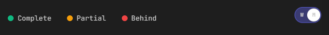
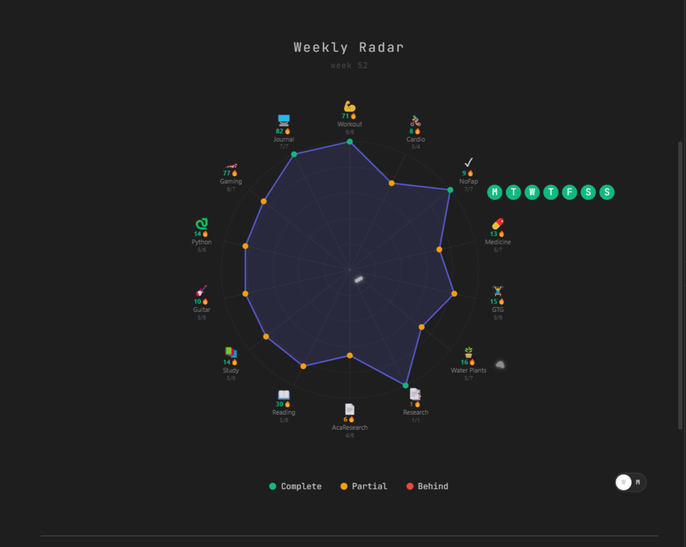
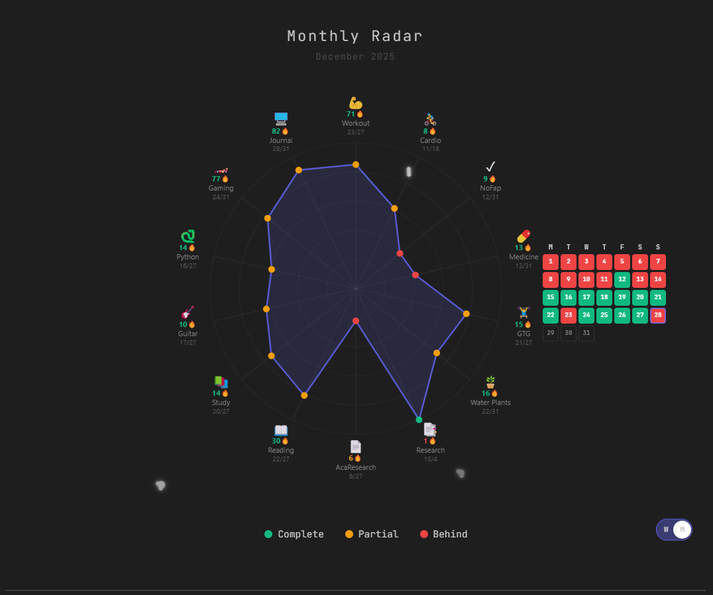

# Weekly Radar


A beautiful spider chart to visualize and track your daily habits across the week (Monday to Sunday). Monitor your progress, maintain streaks, and see your completion patterns at a glance with interactive hover tooltips.

---

## Table of Contents

[Features](#features)
[Requirements](#requirements)
[Installation](#installation)
[Changelog](#changelog)
[Detailed Guide for Tweaking](#detailed-guide-for-tweaking)
[Version](#version)

---

## Features

- **Visual Progress Tracking** - Spider chart shows weekly/monthly completion at a glance.
- **Streak Counter** - Track consecutive days for each habit.
- **Flexible Targets** - Set custom weekly goals that auto-scale for monthly view.
- **Dual View Modes** - Toggle between weekly and monthly perspectives.
- **Interactive Tooltips** - Hover to see daily (M T W T F S S) or monthly calendar completion.
- **Fully Customizable** - Colors, sizes, positions, and thresholds.
- **Boolean & Numeric Support** - Track yes/no habits or numerical values.
- **Smart Future Handling** - Future dates show as transparent, not incomplete.

---

## Requirements

**Dataview** plugin is required to run this code in Obsidian.

---

## Installation

### Prerequisites

- Obsidian (any recent version)
- Dataview plugin installed and enabled

### Step 1: Set Up Your Vault Structure

- Create folders for each activity you want to track:
  - Example: 01 Daily Journal, 02 Workout, 03 Guitar Practice, 05 Cycling

- Create daily notes in these folders with consistent naming:
  - Default format: YYYY-MM-DD (e.g., 2024-12-28)
  - Or use custom formats like: DD, dddd, MMM, YYYY (e.g., 28, Saturday, Dec, 2024)

- Add properties to your daily notes:
  - Use checkbox properties for true/false tracking (e.g., Workout: true)
  - Or numeric properties for number-based tracking (e.g., Steps: 10000)

### Step 2: Install the Radar

- Create a new note where you want the radar to appear
  - Copy the entire source code from weekly-radar.js
  - Paste it between dataviewjs code blocks:

```dataviewjs
// ```dataviewjs
//  [paste code here (I have used "//" for commenting out)]
// ```
```

### Step 3: Configure Your Activities

```dataviewjs
const items = [
    { icon: "💪", label: "Workout", pages: '"02 Workout"', field: "Workout", target: 6, type: "boolean" },
    { icon: "📖", label: "Reading", pages: '"06 Readings"', field: "Reading", target: 10, type: "numeric" },
    // Add more activities...
]
```

- `icon` - Any emoji you like (💪, 📚, 🎸, etc.)
- `label` - Display name shown on the radar
- `pages` - Folder name in double quotes within single quotes: `"folder name"`
- `field` - Property name from your daily notes (case-sensitive)
- `target` - Weekly goal (automatically scales for monthly view)
- `type` - `"boolean"` for checkboxes, `"numeric"` for numbers

> **IMPORTANT:** Set your targets based on a 7-day week, not monthly totals. When you toggle to monthly view, targets automatically scale based on the number of days in that month (e.g., 6 workouts/week → ~26 workouts in a 31-day month).

### Step 4: Customize (Optional)

- Change date format in `const journalFormat = "YYYY-MM-DD"`
- Adjust colors in `const COLORS = { ... }`
- Modify thresholds in `STREAK_THRESHOLDS` and `PROGRESS_THRESHOLDS`

### Step 5: Use It

- View your weekly progress at a glance
- Hover over activities to see daily/monthly completion
- Toggle between weekly (W) and monthly (M) views
- Watch your streaks grow

---

## Changelog

### 1.1.3

The new update lets you see your progress for the ongoing week as well as the month just by hovering over the activity. You can set the radar and hover UI to week or month with a toggle.



You will see days (M, T, W, etc.) and dates (21,22,23, etc.) with green and red fills. Green is for tasks completed, and red is for tasks incomplete.

For `"boolean"` values, it will simply work like `True` and `False`, green and red, respectively. For `"numeric"` values, it will simply show green if you filled in the property and show red if it is blank.

One important thing to note is that the colours will not show for the day that has not yet started. For eg, it will show blank (transparent background) for tomorrow (a day that's not yet started). It will simply show the day or date according to the toggle you have set.

This is how it will look when you have set the toggle to `W` (weekly) and hover the mouse pointer over an activity.



And when you switch to `M` (monthly), and hover the mouse pointer over again, you will see a calendar for the ongoing month.



### 1.1.2

You can set numeric values in your properties. And set the `type` in the source code to `numeric` for it to accept numeric values from your notes. Rest stays the same.

For example:

```dataviewjs
{ icon: "💵", label: "Money Saved", pages: '"Daily Journals"', field: "moneySaved", target: 1000, type: "numeric" }
```

Other global values can also be changed, like `MAX_STREAK_GAP` for maximum gap allowed between completions, `CANVAS_SIZE` to set your canvas size, `RADAR_MAX_RADIUS` to set a maximum radius of your radar, `STREAK_THRESHOLDS` for setting when the colour of the points changes, and finally `PROGRESS_THRESHOLDS` for differentiation between `complete` and `partial`.

### 1.1.1

You can now set a global `journalFormat` as per your preference. It can be `YYYY-MM-DD` (which is the default) or `DD-MM-YY` as some people might prefer to store their notes.

---

## Detailed Guide for Tweaking

### Tooltip Styling

#### Main Tooltip Container

```dataviewjs
const tooltip = document.createElement("div")
tooltip.style.cssText = `
```

- `position`: How the tooltip is positioned.
  - Examples: `absolute`, `fixed`, `relative`
  - Default: `absolute`

- `background`: Background color/style of tooltip.
  - Examples: `none`, `rgba(0, 0, 0, 0.9)`,`#1a1a1a`, `linear-gradient(to right, #667eea, #764ba2)`
  - Default: `none` (transparent)

- `color`: Text color.
  - Examples: `white`, `#ffffff`, `rgb(255, 255, 255)`, `var(--text-normal)`
  - Default: `white`

- `padding`: Space inside the tooltip.
  - Examples: `8px`, `12px 16px`, `10px 20px` `10px 20px`
  - Default: `12px 16px`

- `border-radius`: Rounded corners.
  - Examples: `0px` (square), `6px`, `12px`, `50%` (circular)
  - Default: `6px`

- `font-size`: Size of text.
  - Examples: `12px`, `14px`, `16px`, `1em`, `1.2rem`
  - Default: `14px`

- `font-weight`: Thickness of text.
  - Examples: `400` (normal), `600` (semi-bold), `700` (bold), `900` (extra bold)
  - Default: `700`

- `pointer-events`: Whether tooltip can be clicked.
  - Examples: `none` (can't interact), `auto` (can interact)
  - Default: `none`

- `opacity`: Visibility level.
  - Examples: `0` (invisible), `0.5` (half visible), `1` (fully visible)
  - Default: `0` (hidden until hover)

- `transition`: Animation speed.
  - Examples: opacity `0.1s`, opacity `0.5s`, all `0.3s` ease-in-out
  - Default: opacity `0.2s`

- z-index: Stacking order (higher = on top).
  - Examples: `999`, `1000`, `9999`
  - Default: `1000`

### Weekly View Tooltip (M T W T F S S circle)

```dataviewjs
weekHTML += `<div style="width: 26px; height: 26px; background: ${color}; ...
```

- `width`/`height`: Size of each day circle.
  - Example: `20px`, `26px`, `30px`
  - Default: `26px`

- `background`: Color of the circle (auto-set based on completion).
  - Green (complete): `#10b981`
  - Red (incomplete): `#ef4444`
  - Transparent (future): `transparent`

- `border-radius`: Roundness of shape.
  - Examples: `50%` (circle), `4px` (rounded square), `0%` (square)
  - Default: `50%`

- `gap`: Space between circles.
  - Location: `<div style="display: flex; gap: 6px;">`
  - Examples: `4px`, `6px`, `8px`, `10px`
  - Default: `6px`

- `font-size`: Size of day letters (M, T, W, etc).
  - Examples: `300` (light), `400` (normal), `600` (semi-bold)
  - Default: `400`

### Monthly View Tooltip (Calendar Grid)

#### Calendar Container

```dataviewjs
let calendarHTML = '<div style="background: none; padding: 8px; border-radius: 8px;">'
```

- `background`: Background of entire calendar.
- `padding`:  Space around calendar.
- `border-radius`: Rounded corners of calendar box

#### Day Header Row

```dataviewjs
calendarHTML += '<div style="display: grid; grid-template-columns: repeat(7, 24px); gap: 3px; margin-bottom: 4px;">'
```

- `grid-template-columns`: Width of each column.
  - Examples: `repeat(7, 20px)`, `repeat(7, 24px)`
  - Default: `repeat(7, 24px)`

- `gap`: Space between day headers.

- `margin-bottom`: Space below headers.
  - Examples: `2px`, `4px`
  - Default: `4px`

- `font-size`: Size of `M` `T` `W` letters.

#### Data Cells

```dataviewjs
calendarHTML += `<div style="width: 24px; height: 24px; background: ${color}; ...
```

- `width`/`height`
- `background`
- `border-radius`
- `font-size`
- `font-weight`
- `color`
- `border`: Highlight for current date.
  - Examples: `border: 2px solid #10b981;`, `border: 3px solid gold;`
  - Default: `2px solid rgba(99, 102, 241, 0.8)` (purple)
- `border`: Future date border.

### Legend

```dataviewjs
const legend = dv.el("div", "", {
    attr: {
        style: `
        margin-top: 30px;
        display: flex;
        gap: 24px;
        justify-content: center;
        font-size: 0.85em;
        `
    }
})
```

- `margin-top`: Space above legend.
- `gap`
- `justify-content`: Horizontal alignment.
  - Examples: `center`,`flex-start` (left), `flex-end` (right), `space-between`
  - Default: `center`
- `font-size`

#### Legend Item Circles

```dataviewjs
width: 12px;
height: 12px;
border-radius: 50%;
```

- `width`/`height`
- `border-radius`

### iOS Toggle Switch

#### Toggle Container

```dataviewjs
const toggleContainer = dv.el("div", "", {
    attr: {
        style: `
        position: absolute;
        right: 0;
        top: 50%;
        transform: translateY(-25%);
        ...
```

- `position`
- `right`: Distance from right edge.
  - Examples: `0`, `20px`, `40px`
  - Can also us `left` instead: `left: 0`
  - Default: `0`

- `top`: Vertical position.
  - Examples: `0%`, `50%`
  - Default: `50%`

- `transform`: Fine-tune vertical alignment.
  - Examples: `translateY(-50%)`, `translateY(-25%)`, `translateY(0%)`
  - Default: `translateY(-25%)`

#### Toggle Switch Track

```dataviewjs
toggleSwitch.style.cssText = `
    width: 55px;
    height: 33px;
    background: rgba(255, 255, 255, 0.05);
    ...
```

- `width`/`height`
- `background`: When ON in `if` and OFF in `else`.
- `backdrop-filter`: Blur effect behind switch.
  - Examples: `blur(5px)`, `blur(10px)`, `blur(15px)`, `none`
  - Default: `blur(10px)`
- `border-radius`: Roundness of switch.
- `transition`: Animation speed for state changes.

#### Toggle Knob

```dataviewjs
toggleKnob.style.cssText = `
    width: 27px;
    height: 27px;
    background: white;
    ...
```

- `width`/`height`
- `background`
- `border-radius`
- `top`
- `left`
- `transition`
- `box-shadow`: Shadow under knob.
  - Examples: `0 2px 4px rgba(0,0,0,0.2)`, `0 4px 8px rgba(0,0,0,0.3)`, `none`
  - Default: `0 2px 4px rgba(0,0,0,0.2)`

#### Toggle Labels (W and M)

```dataviewjs
toggleKnob.style.cssText = `
    width: 27px;
    height: 27px;
    background: white;
    ...
```

- Label W `left`: Distance from left edge.
  - Examples: `8px`, `10px`
  - Default: `11px`

- Label M `right`: Distance from right edge.
  - Examples: `8px`, `10px`
  - Default: `11px`

- `font-size`
- `font-weight`
- `color`

### Color Customisation

#### Global Color Constants

In `const COLORS = {` you can set global color constants:

```dataviewjs
const COLORS = {
    complete: "#10b981",    // Green for completed tasks
    partial: "#f59e0b",     // Orange for partial progress
    behind: "#ef4444",      // Red for behind/incomplete
    radarFill: "rgba(99, 102, 241, 0.15)",    // Purple fill of radar
    radarStroke: "rgba(99, 102, 241, 0.8)"    // Purple outline of radar
};
```

- `complete`: `#10b981` (green), `#22c55e`, `#4ade80`, `#059669`
- `partial`: `#f59e0b` (orange), `#fbbf24`, `#f97316`, `#fb923c`
- `behind`: `#ef4444` (red), `#dc2626`, `#f87171`, `#991b1b`
- `radarFill`: `rgba(99, 102, 241, 0.15)`, `rgba(16, 185, 129, 0.2)`, `rgba(239, 68, 68, 0.1)`
- `radarStroke`: `rgba(99, 102, 241, 0.8)`, `rgba(16, 185, 129, 1)`, `#6366f1`

### Tips for Customisation

1. To change switch size: Update width, height, and the left position in the click handler.
2. To reposition toggle: Modify right, top, and transform in toggleContainer.
3. To change color scheme: Modify the COLORS object at the top of the file.
4. To adjust tooltip size: Change width, height, font-size in respective tooltip sections.
5. To make calendar bigger: Increase grid-template-columns values and cell width/height proportionally.

---

## Version

- 1.1.3 - 28 December 2025
- 1.1.2 - 27 December 2025
- 1.1.1 - 27 December 2025
