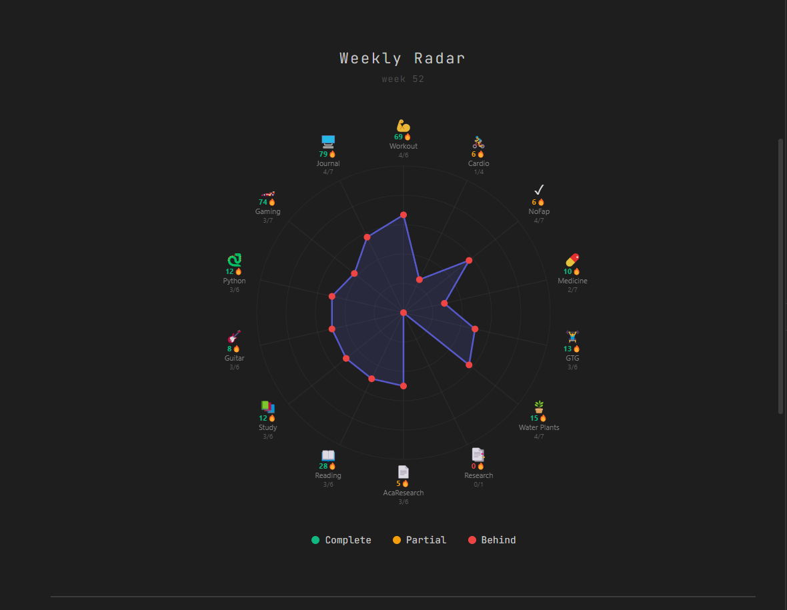
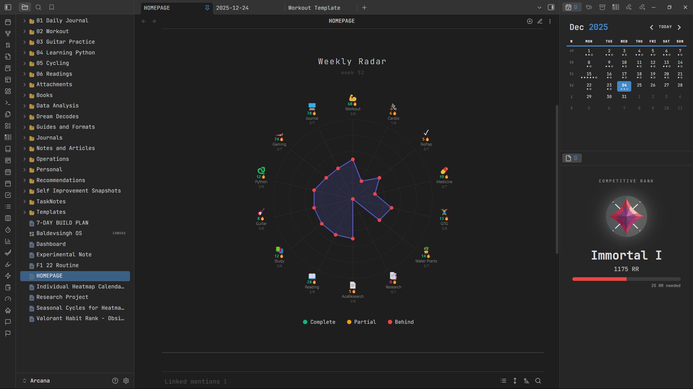

# Weekly Radar




Weekly radar is a spider chart to track your activities for a week (Monday to Sunday). I will keep it short.

You need to have folders for each activities you want to track. For example, "01 Daily Journal" for daily journalling (in my case), "05 Cycling" for cycling journals.

Then create the properties for the activities you want to track and mention the folder your daily notes are stored in. The properties should be in the checkbox style only.

You can customize the way you name your daily journals, by default it is `YYYY-MM-DD`. The code will also accept complicated note names like `DD, dddd, MMM, YYYY`.

In `const items = []`, you can change the following things:

- `icon` = to any emojis you like
- `label` = display name in th radar
- `pages` = folder your daily notes are saved in
- `field` = name of the properties
- `target` = set target for the week
- `type` = `"boolean"` for true/false, `"numeric"` for numerical values

You can stack all the activities/properties in a single daily journal too. Like I have for `Medicine`, `Research`, `waterPlants`, `Gaming`, etc.

You can change the background circles style and color in `// Draw background circles`, change the axes `// Draw axes`. Alter the points on the progress line in `// Draw points on progress line`. You can also use `// Draw labels` to tweak changes as per your liking.

I have attached the `dataviewjs` source code. Simply paste the code starting with ` ```dataviewjs ` and end with ` ``` `. Then, you can start customizing.

**Dataview** plugin is required to run this code in Obsidian.

## Changelog

- **1.1.2**

You can set numeric values in your properties. And set the `type` in the source code to `numeric` for it accept numeric values from your notes. Rest stays the same.

Other global values can also be changed like `MAX_STREAK_GAP` for maximum gap allowed between completions, `CANVAS_SIZE` to set your canvas size, `RADAR_MAX_RADIUS` to set a maximum radius of your radar, `STREAK_THRESHOLDS` for setting when the color of the points change, and finally `PROGRESS_THRESHOLDS` for differentiation between `complete` and `partial`.

- **1.1.1**

You can now set a global `journalFormat` as per your preference. It can be `YYYY-MM-DD` (which is the default) or `DD-MM-YY` as some people might prefer to store their notes.

## Version

- 1.1.2 - 27 December 2025
- 1.1.1 - 27 December 2025
